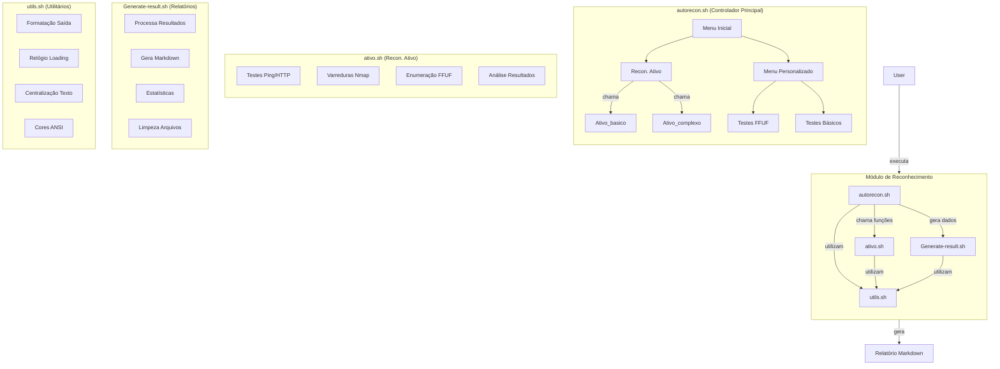

# Módulo de Reconhecimento

Este módulo contém scripts para automação de tarefas de reconhecimento ativo e passivo, focando na coleta de informações sobre alvos para testes de penetração.

## Data-Flow 



## Conteúdo do Módulo

- `autorecon.sh`: Script principal para orquestrar o reconhecimento.
- `ativo.sh`: Contém funções para execução de testes de reconhecimento ativo.
- `Generate-result.sh`: Responsável por processar os resultados e gerar relatórios.
- `utils.sh`: Fornece funções utilitárias e de formatação de saída.

### `autorecon.sh`

**Função:** Este é o script controlador principal do módulo de reconhecimento. Ele gerencia os menus de interação com o usuário, chama os testes de reconhecimento (ativos e, futuramente, passivos) e organiza os resultados para serem processados pelo `Generate-result.sh`.

**Dependências:** `utils.sh`, `ativo.sh`, `Generate-result.sh`.

**Variáveis Globais:**
- `TARGET`: O IP, domínio ou URL alvo definido pelo usuário.
- `TARGET_IPv4`: O endereço IPv4 resolvido do alvo.
- `TARGET_IPv6`: O endereço IPv6 resolvido do alvo.
- `TYPE_TARGET`: O tipo de alvo (IP ou DOMAIN).
- `CHECKLIST`: Um array para armazenar o status de cada teste executado.
- `START_TIME`: O timestamp de início da execução do script.
- `RESULTS_DIR`: O diretório onde os resultados serão salvos (padrão: `results`).
- `CLEAN_RESULTS`: Opção para ativar/desativar a limpeza automática de arquivos residuais (`yes`/`no`).

**Funções Auxiliares:**
- `validar_root()`: Verifica se o script está sendo executado com privilégios de root.
- `clean_results()`: Limpa os arquivos residuais no diretório de resultados, se `CLEAN_RESULTS` estiver ativado.
- `verificar_tipo_alvo()`: Determina se a entrada do usuário é um IP, domínio ou inválida.
- `definir_alvo()`: Solicita ao usuário o alvo e tenta resolver seu IP (IPv4 e IPv6).

**Funções de Teste (chamadas pelo menu personalizado):**
- `test_dig()`: Executa um teste DNS usando `dig`.
- `test_traceroute()`: Realiza um traceroute para o alvo.
- `test_curl_headers()`: Verifica os cabeçalhos HTTP do alvo usando `curl`.

**Menus:**
- `menu_personalizado()`: Oferece opções para testes específicos de FFUF (subdomínios, diretórios, extensões) e testes básicos (ping, DNS, traceroute, HTTP).
- `menu_inicial()`: O menu principal que permite ao usuário escolher entre reconhecimento ativo, personalizado ou sair. Também instala dependências essenciais (jq, dig, nmap, ffuf, traceroute, curl, nc).

**Uso:**
O script deve ser executado com privilégios de root. Ele apresentará um menu inicial para o usuário escolher a estratégia de reconhecimento (ativo ou personalizado).

```bash
sudo ./autorecon.sh
```

### `ativo.sh`

**Função:** Este script contém as funções responsáveis por executar os testes de reconhecimento ativo contra o alvo. Ele é chamado pelo `autorecon.sh` para realizar varreduras e coletas de informações de forma ativa.

**Dependências:** `utils.sh`.

**Variáveis Globais:**
- `WORDLISTS_DIR`: Diretório onde as wordlists são armazenadas (padrão: `/home/wordlists`).
- `PORT_STATUS_IPV4`, `PORT_STATUS_IPV6`: Arrays associativos para armazenar o status das portas para IPv4 e IPv6.
- `PORT_TESTS_IPV4`, `PORT_TESTS_IPV6`: Arrays associativos para contar o número de testes por porta.
- `RESULTS_DIR`: Diretório para salvar os resultados (herdado de `autorecon.sh`).

**Variáveis de Comandos:**
- `NMAP_COMMANDS_IPV4`, `NMAP_COMMANDS_IPV6`: Arrays contendo comandos Nmap para varreduras IPv4 e IPv6 (ex: varredura TCP SYN, detecção de SO, detecção de serviço).
- `FFUF_COMMANDS`, `FFUF_WEB_COMMANDS`, `FFUF_EXT_COMMANDS`: Arrays contendo comandos FFUF para enumeração de subdomínios, diretórios web e extensões de arquivos, respectivamente.

**Funções Auxiliares:**
- `determinar_protocolo()`: Tenta determinar o protocolo (HTTP ou HTTPS) do alvo.
- `substituir_variaveis()`: Substitui placeholders nos comandos (ex: `{TARGET_IP}`, `{URL}`, `{WORDLIST_SUBDOMAINS}`) pelos valores reais. Também baixa wordlists se não existirem localmente.
- `executar_comando()`: Função genérica para executar um comando e registrar seu status na `CHECKLIST`.
- `analyze_nmap_results()`: Analisa os resultados de varreduras Nmap em formato XML para consolidar o status das portas.
- `consolidar_portas()`: Consolida os resultados de múltiplos testes Nmap para cada porta e adiciona à `CHECKLIST`.

**Funções de Teste Ativo:**
- `test_ping()`: Realiza testes de ping para verificar a conectividade com o alvo (IPv4 e IPv6).
- `test_http()`: Testa a acessibilidade HTTP/HTTPS do alvo usando `curl`.
- `test_ffuf_subdomains()`: Executa varreduras FFUF para encontrar subdomínios.
- `test_ffuf_directories()`: Executa varreduras FFUF para encontrar diretórios web.
- `test_ffuf_extensions()`: Executa varreduras FFUF para encontrar extensões de arquivos web.
- `Ativo_basico()`: Agrupa testes ativos básicos (ping, HTTP).
- `Ativo_complexo()`: Agrupa testes ativos mais complexos (Nmap, FFUF para subdomínios, diretórios e extensões).

### `Generate-result.sh`

**Função:** Este script é responsável por processar todos os resultados coletados pelos testes de reconhecimento e gerar um relatório final em formato Markdown. Ele consolida as informações, adiciona metadados, configurações das ferramentas e estatísticas.

**Dependências:** `utils.sh`, `ativo.sh`.

**Funções Auxiliares:**
- `sanitize_string()`: Limpa strings para evitar caracteres problemáticos em saídas e relatórios.
- `get_metadata()`: Coleta e formata metadados da análise, como script, SO, hora de início, usuário, alvo, IPs resolvidos e tipo de alvo.
- `get_tool_config()`: Gera uma seção no relatório com as configurações dos comandos Nmap e FFUF utilizados.
- `get_dependencies()`: Lista o status de instalação das dependências do script (jq, nmap, ffuf, dig, traceroute, curl, nc, xmllint).
- `clean_intermediate_files()`: Remove arquivos temporários e intermediários gerados durante a execução dos testes.
- `save_test_result()`: Salva o resultado de um teste individual no relatório Markdown, incluindo status, mensagem, timestamp e detalhes.
- `process_test_results()`: Itera sobre a `CHECKLIST` (lista de resultados dos testes) e chama `save_test_result` para cada item, além de contar sucessos e falhas.
- `process_result_files()`: Incorpora o conteúdo de arquivos de resultados (txt, csv, xml) gerados pelos testes no relatório final, formatando-os adequadamente.
- `generate_statistics()`: Calcula e adiciona estatísticas gerais ao relatório, como total de testes, testes bem-sucedidos, testes com falha e tempo total de execução.
- `save_report()`: Função principal que orquestra a geração do relatório, chamando as funções auxiliares para coletar metadados, processar resultados, incorporar arquivos e gerar estatísticas. Também configura um manipulador de interrupção para limpeza de arquivos.

### `utils.sh`

**Função:** Este script contém funções utilitárias e de formatação de saída que são compartilhadas entre os outros scripts do módulo de Reconhecimento (`autorecon.sh`, `ativo.sh`, `Generate-result.sh`). Ele padroniza a exibição de mensagens e fornece ferramentas para melhorar a experiência do usuário no terminal.

**Dependências:** Nenhuma dependência externa direta, mas utiliza variáveis globais definidas em `autorecon.sh` (como `TARGET`, `TYPE_TARGET`, `TARGET_IPv4`, `TARGET_IPv6`, `CHECKLIST`) para exibir informações no relógio de carregamento.

**Variáveis Globais:**
- `BLUE`, `CYAN`, `GREEN`, `YELLOW`, `PURPLE`, `WHITE`, `RED`, `NC`: Variáveis para códigos de cores ANSI, usadas para formatar a saída do terminal. Se o terminal não suportar cores, as variáveis serão vazias.

**Funções:**
- `print_status(color, message)`: Exibe mensagens formatadas no terminal com cores diferentes para `info`, `action`, `success` e `error`.
- `centralizar(texto)`: Centraliza um texto na largura do terminal. Se `tput` não estiver disponível, o texto é impresso sem centralização.
- `print_clock_frame(frame, task, hora)`: Desenha um frame de um relógio ASCII no terminal, exibindo a hora atual, o alvo, o tipo de alvo, IPs resolvidos, a tarefa em execução e o checklist de testes. Alterna entre dois frames para criar uma animação de relógio.
- `loading_clock(task, duration)`: Exibe um relógio de carregamento animado no terminal por uma duração especificada, mostrando a tarefa atual e o progresso do checklist. Utiliza `print_clock_frame` para a animação.
