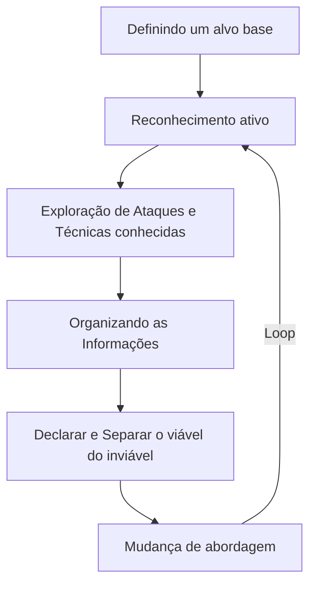

Este documento descreve uma metodologia estruturada para testes de penetração utilizando o SKEF (Speed Kill execution Framework ), dividida em 6 etapas principais.

---
# 1 - Definindo um alvo base.

- **Objetivo**: Estabelecer o escopo inicial do teste.

- **Atividades**:

1. Identificação de sistemas, redes ou aplicações alvo.
2. Definição de regras de engajamento (RoE).
3. Estabelecimento de objetivos específicos.

# 2 - Reconhecimento ativo.

- **Objetivo**: Estabelecer o escopo inicial do teste.

- **Atividades**:

1. Varredura de portas e serviços (Nmap).
2. Enumeração de diretórios e arquivos.
3. Identificação de tecnologias utilizadas.

# 3 - Exploração de Ataques e Técnicas conhecidas.

- **Objetivo**: Identificar e detectar vulnerabilidades existentes.

- **Atividades**:

1. Exploração de CVEs conhecidos.
2. Teste de configurações incorretas.

# 4 - Organizando as Informações.

- **Objetivo**: Estruturar os dados coletados

- **Atividades**:

1. Documentação de vulnerabilidades encontradas.
2. Classificação por criticidade (CVSS).
3. Preparação de evidências para relatório.

# 5 - Declarar e Separar o viável do inviável.

- **Objetivo**: Priorizar ações e identificar limitações.

- **Atividades**:

1. Identificação de falsos positivos.
2. Determinação de vetores de ataque inviáveis.
3. Foco em vulnerabilidades exploráveis.

# 6 - mudança de abordagem.

- **Objetivo**: Adaptar a estratégia conforme resultados.

- **Atividades**:

1. Reavaliação de técnicas quando bloqueadas.
2. *Pivotagem* para outros sistemas/redes.
3. Ajuste de técnicas de evasão.
4. Retorno a etapas anteriores com nova perspectiva.